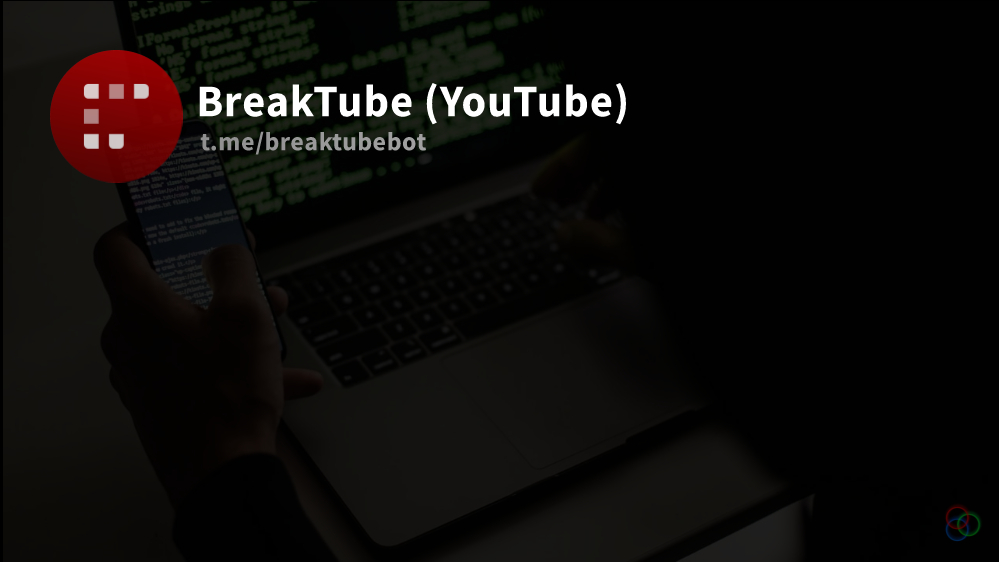

# Welcome to BreakTube - Your Ultimate Telegram YouTube Video Downloader Bot! 🎥🤖

BreakTube is a powerful Telegram bot built using Pyrogram that allows you to easily download YouTube videos, playlists, channels, and more directly through Telegram. With BreakTube, you can access a wide range of features designed to enhance your video downloading experience.

### Features:
- **Channel Joining**: Easily join any channel and access video content.
- **Information Retrieval**: Get detailed information about videos, playlists, and channels.
- **Search Functionality**: Search for playlists, videos, and channels effortlessly.
- **Multiple Formats**: Download videos in MKV, MP3, and MP4 formats for your convenience.
- **Download Images and Subtitles**: Extract images and subtitles from videos.
- **Playlist Downloads**: Download entire playlists in 720p format as well as in MP3 format.
- **Channel Notifications**: Receive notifications for new videos in your subscribed channels.
- **Multi-language Support**: Enjoy BreakTube in 14 different languages for a personalized experience.

### How to Use BreakTube:
1. **Join a Channel**: Simply join any channel to start accessing video content.
2. **Retrieve Information**: Use the bot to get information about specific videos, playlists, or channels.
3. **Search and Download**: Search for your desired content and download it in your preferred format.
4. **Stay Updated**: Keep track of new videos through channel notifications.
5. **Multi-language Support**: Customize your BreakTube experience in your preferred language.

### Get Started:
1. Start a chat with BreakTube on Telegram ([@BreakTubeBot](https://t.me/BreakTubeBot)).
2. Access a wide range of features and start downloading your favorite YouTube content seamlessly.
3. Enjoy the convenience and flexibility that BreakTube offers for all your video downloading needs!

### Acknowledgements:
- Developed with ❤️ by OsZayn
- Built using [Pyrogram](https://github.com/pyrogram/pyrogram) - A powerful Telegram library for Python.

### Contact:
For any queries, feedback, or support, feel free to reach out via Telegram at [t.me/triple_link](https://t.me/triple_link).

Let's make your YouTube downloading experience smoother and more enjoyable with BreakTube! 🚀🎬🎧
